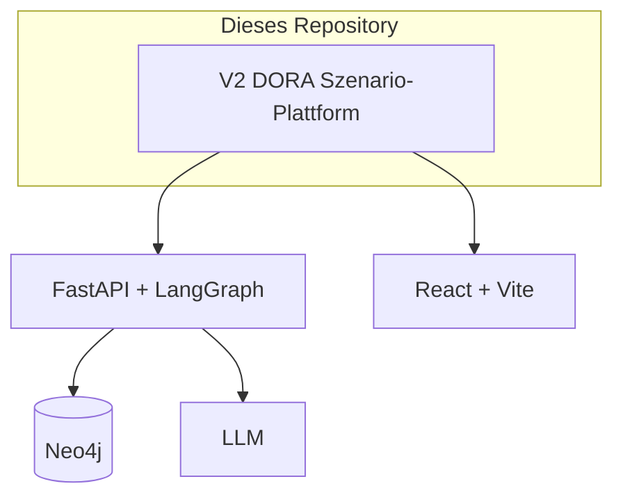

# NS-MAS / DORA-Szenario-Plattform

**Repository:** [github.com/FinnHai/ns-mas-dora-compliance](https://github.com/FinnHai/ns-mas-dora-compliance)

Öffentliches Repository mit dem **NS-MAS-Prototyp**: LLM-basierte Szenario-Generierung mit Knowledge-Graph-Validierung (MITRE ATT&CK).



## Quick Start (V2)

Siehe [V2/README.md](V2/README.md). Kurz: `cd V2/backend && pip install -r requirements.txt && ./run.sh` (Backend), `cd V2/frontend && npm install && npm run dev` (Frontend). Umgebungsvariablen: `V2/backend/.env.example` nach `.env` kopieren.

## Dokumentation

- [V2/docs/](V2/docs/) – Architektur
- [V2/backend/VALIDIERUNGSTESTS_ERGEBNISSE.md](V2/backend/VALIDIERUNGSTESTS_ERGEBNISSE.md) – Validierungstests

## Struktur

- **V2/** – DORA-Szenario-Plattform / NS-MAS (Backend + Frontend)

## Repository klonen

```bash
git clone https://github.com/FinnHai/ns-mas-dora-compliance.git
```
