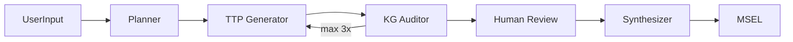

# DORA Szenario-Plattform

Neuro-symbolisches Multi-Agenten-System (NS-MAS) zur Unterstützung der Szenario-Entwicklung im Kontext von DORA. Kombiniert LLM-basierte Generierung mit wissensgraph-basierter Validierung (MITRE ATT&CK).

Architektur (Entwicklungs-Repo): [docs/architecture.md](docs/architecture.md)

## Voraussetzungen

Python 3.11+, Node.js 18+, Neo4j, OpenAI- oder Anthropic-API-Key

## Start (voller Entwicklungsstand)

**Backend:** `cd backend && pip install -r requirements.txt && ./run.sh` (Port 8000)

**Frontend:** `cd frontend && npm install && npm run dev` (Port 5173)

**Umgebungsvariablen:** `backend/.env.example` nach `backend/.env` kopieren und Werte eintragen (OPENAI_API_KEY, NEO4J_*)

## Tests (nur im vollständigen Repo)

`./run_tests.sh` – alle Tests | `./run_tests.sh --unit` – nur Unit-Tests | `./run_verify.sh` – Systemverifikation

## Evaluation

Kanonische Messdaten: `backend/evaluation/n10/eval_n10_results.json`, `eval_n10_results_backup_20260323_1027.json`, `comparison/eval_comparison.json`. Repro-Skripte (`run_eval_n10_verbose.py` usw.) liegen unter `backend/scripts/`.

## Dokumentation

- [docs/architecture.md](docs/architecture.md) – Architektur
- [backend/VALIDIERUNGSTESTS_ERGEBNISSE.md](backend/VALIDIERUNGSTESTS_ERGEBNISSE.md) – Validierungstests
- [frontend/README.md](frontend/README.md) – Frontend-Routen und API
- [ERGEBNISSE.md](ERGEBNISSE.md) – Beschreibung der Evaluations-JSON-Dateien

## Optionales ZIP (nur Backend + Mess-JSONs)

`./package_abgabe.sh` — Details [ABGABE.md](ABGABE.md).
