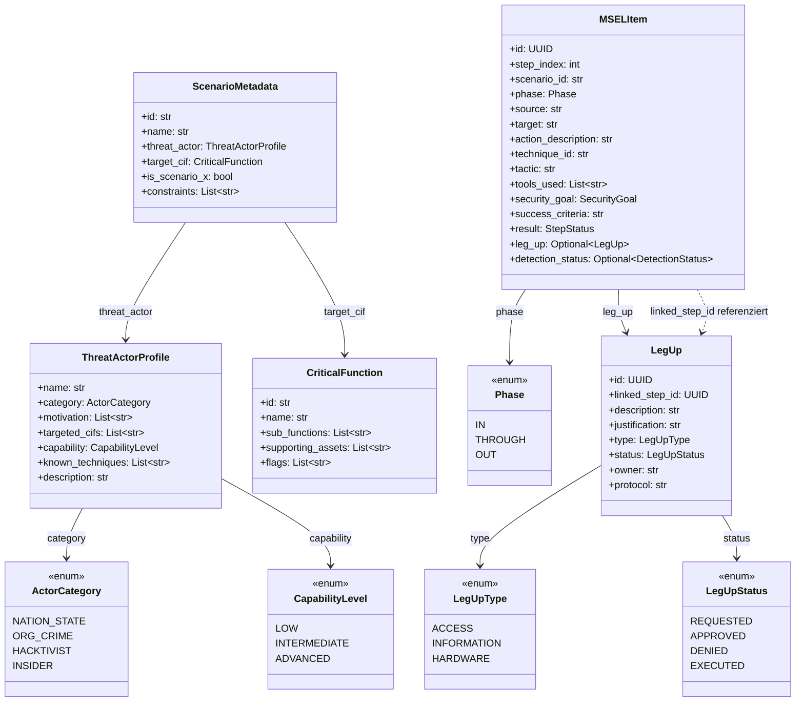

# Datenmodell – TIBER-EU MSEL-Plattform

**Stand:** Februar 2025  
**Charakter:** Technische Architekturdokumentation für den wissenschaftlichen Bericht

---

## 1. High-Level Übersicht

Das Datenmodell der Szenario-Plattform folgt einer klaren Dreistufigkeit, die den TIBER-EU-Workflow von der Planung bis zur Ausführung abbildet:

```
┌─────────────────┐     ┌─────────────────┐     ┌─────────────────┐
│  enums.py       │     │  strategy.py    │     │  msel.py        │
│  (Vokabular)    │ ──► │  (Input)        │ ──► │  (Output)       │
└─────────────────┘     └─────────────────┘     └─────────────────┘
```

| Schicht | Datei | Rolle | Beschreibung |
|---------|-------|-------|--------------|
| **Vokabular** | `enums.py` | Semantische Basis | Definiert das kontrollierte Vokabular (Phase, SecurityGoal, LegUpType, ActorCategory, etc.). Alle Klassen referenzieren diese Enums – keine Freitext-Werte für regulatorische Konzepte. |
| **Input** | `strategy.py` | Szenario-Planung | `ScenarioMetadata`, `ThreatActorProfile` und `CriticalFunction` beschreiben *was* getestet wird und *wen* der Test simuliert. Diese Modelle sind die Eingabe für die MSEL-Generierung. |
| **Output** | `msel.py` | MSEL-Implementierung | `MSELItem` und `LegUp` repräsentieren die konkreten Ausführungsschritte (Master Scenario Event List). Hier werden die Strategie und der Enums-Vokabular konkretisiert. |

**Datenfluss:** Die Enums liefern die erlaubten Werte für alle drei Schichten. Die Strategy-Modelle beschreiben den Bedrohungskontext und die Ziel-CIF. Daraus wird ein MSEL generiert – eine zeitlich geordnete Folge von `MSELItem` mit optionalen `LegUp`-Referenzen.

---

## 2. TIBER-EU Compliance Mapping

Die folgende Tabelle ordnet Klassen und Felder den regulatorischen Anforderungen des TIBER-EU-Frameworks zu.

| Klasse / Feld | Regulatorische Anforderung | Erläuterung |
|---------------|---------------------------|-------------|
| **MSELItem.phase** | Phasen-Trennung (In/Through/Out) | TIBER-EU verlangt die klare Trennung der Red-Team-Phasen: *Entering* (IN), *Moving* (THROUGH), *Executing/Extracting* (OUT). `Phase`-Enum erzwingt eine dieser drei Werte. |
| **MSELItem.technique_id**, **MSELItem.tactic** | MITRE ATT&CK-Verankerung | TIBER-EU fordert die Nutzung von Threat Intelligence und standardisierter TTPs. Jeder Schritt ist einer MITRE ATT&CK Technik und Taktik zugeordnet. |
| **MSELItem.security_goal** | CIA-Triade als Testziel | Die Bewertung orientiert sich an den Sicherheitszielen Vertraulichkeit, Integrität und Verfügbarkeit. |
| **MSELItem.detection_status**, **MSELItem.blue_team_response** | Blue-Team-Bewertung | Erfassung, ob Angriffsaktionen erkannt oder blockiert wurden – Grundlage für Nachbesprechung und Resilienzverbesserung. |
| **LegUp** (Klasse) | Kontrollierte Hilfestellung | TIBER-EU erlaubt Leg-Ups (physischer/digitaler Zugang, Informationen, Hardware) nur unter strenger Kontrolle. Die Klasse modelliert Genehmigungsprozess (Status, Owner, Rechtfertigung). |
| **LegUp.justification**, **LegUp.owner**, **LegUp.protocol** | Nachvollziehbarkeit von Leg-Ups | Jede Leg-Up muss begründet, einem Genehmiger zugeordnet und mit einem Übergabeprotokoll dokumentiert sein. |
| **LegUp.status** | Governance-Lebenszyklus | Statusenum (REQUESTED → APPROVED/DENIED → EXECUTED) erzwingt formale Entscheidungswege. |
| **ThreatActorProfile** (Klasse) | Threat-Led-Ansatz | TIBER-EU verlangt, dass Szenarien von realen Bedrohungsmodellen abgeleitet werden. `ThreatActorProfile` enthält Kategorie, Motivation, Fähigkeiten und bekannte Techniken. |
| **ThreatActorProfile.category**, **ThreatActorProfile.capability** | Differenzierung von Bedrohungsakteuren | `ActorCategory` und `CapabilityLevel` klassifizieren den simulierten Angreifer (z.B. Nation-Staat vs. Insider, Advanced vs. Low). |
| **ThreatActorProfile.known_techniques** | TTP-Verankerung | Verknüpfung mit MITRE ATT&CK IDs – sichert, dass die gewählten Techniken zum Profil passen. |
| **CriticalFunction** (Klasse) | Fokus auf kritische Funktionen | TIBER-EU zielt auf kritische Infrastruktur und Geschäftsfunktionen. CIF ist das zentrale Testziel. |
| **ScenarioMetadata.target_cif** | Explizite Zieldefinition | Das Szenario muss eine klar definierte CIF als Ziel haben. |
| **ScenarioMetadata.constraints** | Verbotene Aktionen | TIBER-EU verlangt die Festlegung von Grenzen (z.B. keine physische Gewalt, keine Datenexfiltration außerhalb). |
| **ScenarioMetadata.is_scenario_x** | Szenario-X-Kennzeichnung | Markierung für besonders sensible Tests (z.B. Cyber-Angriffe auf Zentralbanken). |

---

## 3. Datenstruktur-Details

### 3.1 CriticalFunction – Mapping von Business zu IT

`CriticalFunction` verbindet die **Business- und Technical View** auf einer kritischen Geschäftsfunktion:

| Attribut | Sicht | Beschreibung |
|----------|-------|--------------|
| `name` | Business | Bezeichnung der Geschäftsfunktion (z.B. „Payment Processing“). |
| `sub_functions` | Business | Aufgeteilte Unterfunktionen für granulare Analyse. |
| `supporting_assets` | Technical | IT-Assets (Server, IPs, Applikationen), die die Funktion unterstützen – direkte Angriffsziele für das Red Team. |
| `flags` | Technical | Konkrete Beweise (z.B. Screenshots, DB-Zugriffe), die den Erfolg einer Angriffsaktion belegen. |

**Logik:** Die Business-Sicht beschreibt *was* für das Geschäft kritisch ist; die Technical-Sicht beschreibt *worauf* getestet wird. Ohne dieses Mapping wäre ein Test nicht gezielt auf die realen Abhängigkeiten der Geschäftsfunktion ausgerichtet.

### 3.2 LegUp – Eigenständige Klasse für Genehmigungsprozess

`LegUp` ist **nicht** als einfaches Feld in `MSELItem` modelliert, sondern als eigene Klasse mit eigener Identität (`id`):

- **Formale Prozesse:** Leg-Ups erfordern Genehmigung, Rechtfertigung und Protokollierung. Ein eigenes Modell erlaubt eine separate Lebenszyklus-Verwaltung (REQUESTED → APPROVED/DENIED → EXECUTED).
- **Auditfähigkeit:** Jede Leg-Up kann einzeln nachverfolgt, abgelehnt oder protokolliert werden. Die Verknüpfung zu `MSELItem` erfolgt über `linked_step_id`.
- **Typisierung:** `LegUpType` (ACCESS, INFORMATION, HARDWARE) und `LegUpStatus` trennen klar *was* gewährt wird und *ob* es genehmigt wurde.
- **Regulatorische Strenge:** TIBER-EU betont, dass Leg-Ups kontrolliert und dokumentiert sein müssen. Eine eigene Klasse entspricht dieser regulatorischen Anforderung an explizite Governance.

---

## 4. Visualisierung – Klassendiagramm



**Beziehungsübersicht:**

- `ScenarioMetadata` aggregiert `ThreatActorProfile` und `CriticalFunction` – die Szenario-Planung.
- `ThreatActorProfile` nutzt `ActorCategory` und `CapabilityLevel` aus dem Enums-Vokabular.
- `MSELItem` referenziert `Phase` und optional `LegUp`.
- `LegUp` ist mit `MSELItem` über `linked_step_id` verknüpft (nicht als Foreign Key in der DB, sondern als semantische Zuordnung).

---

## 5. Referenzen

- **Dateien:** `backend/app/models/enums.py`, `backend/app/models/strategy.py`, `backend/app/models/msel.py`
- **Dokumentation:** `docs/architecture.md`, `docs/tech-dokumentation.md`
- **Framework:** [TIBER-EU](https://www.ecb.europa.eu/pub/pdf/other/ecb.1808tiber_eu_framework.en.pdf) – European Framework for Threat Intelligence-Based Ethical Red Teaming
