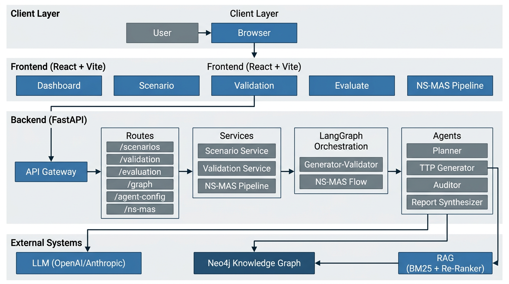
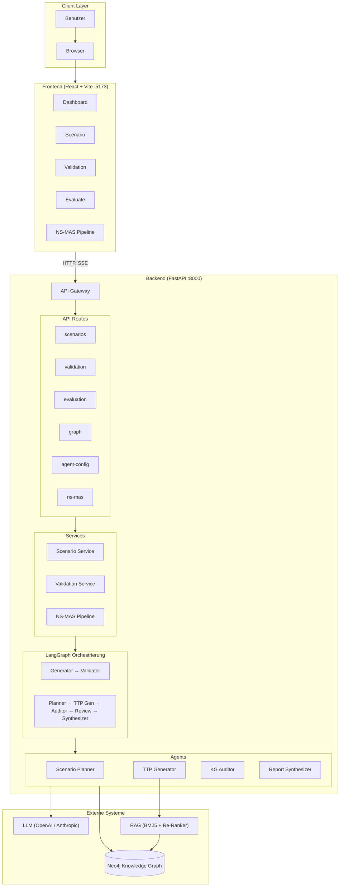
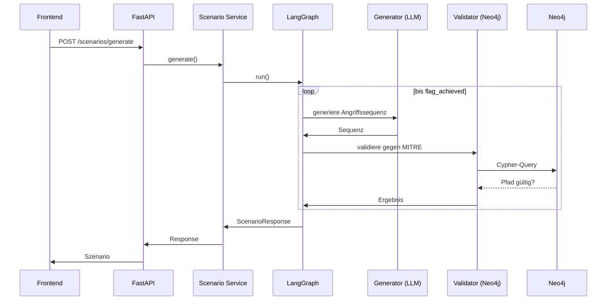
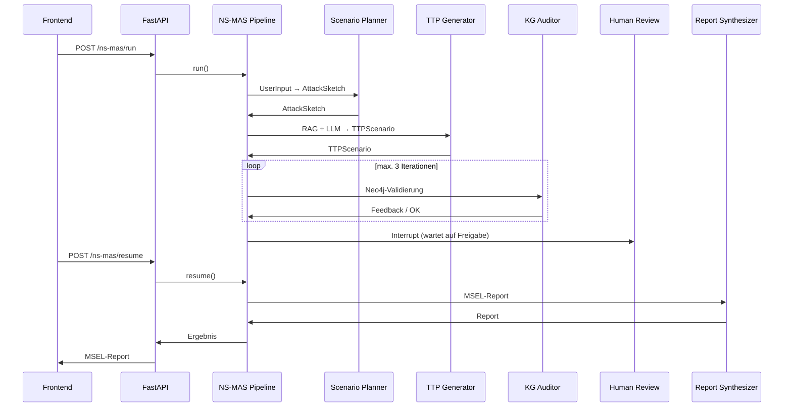

# DORA Szenario-Plattform | High-Level Architektur

## Übersicht

Die Plattform ist ein **neuro-symbolisches Multi-Agenten-System (NS-MAS)** zur Unterstützung der Szenario-Entwicklung im Kontext von DORA (Digital Operational Resilience Act). Sie kombiniert LLM-basierte Generierung mit wissensgraph-basierter Validierung (MITRE ATT&CK).

---

## High-Level Architekturdiagramm

### Mermaid-Quelle (für Editoren mit Mermaid-Support)

---

## Datenfluss – Zwei Haupt-Pipelines

### Pipeline A: Klassische Szenario-Generierung

### Pipeline B: NS-MAS-Pipeline

---

## Komponenten-Übersicht

| Schicht | Komponente | Technologie | Beschreibung |
|---------|------------|-------------|--------------|
| **Frontend** | React App | React, TypeScript, Vite | Dashboard, Szenario-Erstellung, Validierung, Evaluation, NS-MAS |
| **Backend** | FastAPI | FastAPI, Uvicorn | REST-API, CORS, Routen |
| **Orchestrierung** | LangGraph | LangGraph, LangChain | StateGraph, Checkpointer, Generator–Validator, NS-MAS-Flow |
| **Agents** | Planner, TTP Gen, Auditor, Synthesizer | Python | LLM-gesteuerte Agenten |
| **Knowledge Graph** | Neo4j | Neo4j, Cypher | MITRE ATT&CK (Tactic, Technique, PRECEDES) |
| **RAG** | Retriever | BM25, Re-Ranker | Technik-Retrieval für TTP Generator |
| **LLM** | OpenAI / Anthropic | gpt-4o-mini, Claude | Generierung, Planung, Synthese |

---

## API-Endpunkte

| Prefix | Methoden | Funktion |
|--------|----------|----------|
| `/scenarios` | POST /generate, /generate/stream, GET /, GET /{id} | Szenario-Generierung (sync/stream), Liste, Detail |
| `/validation` | POST / | Validierung gegen MITRE ATT&CK |
| `/evaluation` | POST /compare | Neuro vs. Baseline |
| `/graph` | GET /tactics, /techniques, POST /validate-path | Neo4j-Taktiken, Techniken, Pfadvalidierung |
| `/agent-config` | GET | Agent-Konfiguration |
| `/ns-mas` | POST /run, POST /resume | NS-MAS-Pipeline (inkl. Human Review) |
| `/health` | GET | Health-Check |

---

## Konfiguration

- **`config/settings.yaml`**: LLM, Neo4j, RAG, Pipeline-Parameter
- **`.env`**: API-Keys, Neo4j-Credentials (Pydantic Settings)

---

*Erstellt für die DORA Szenario-Plattform*
